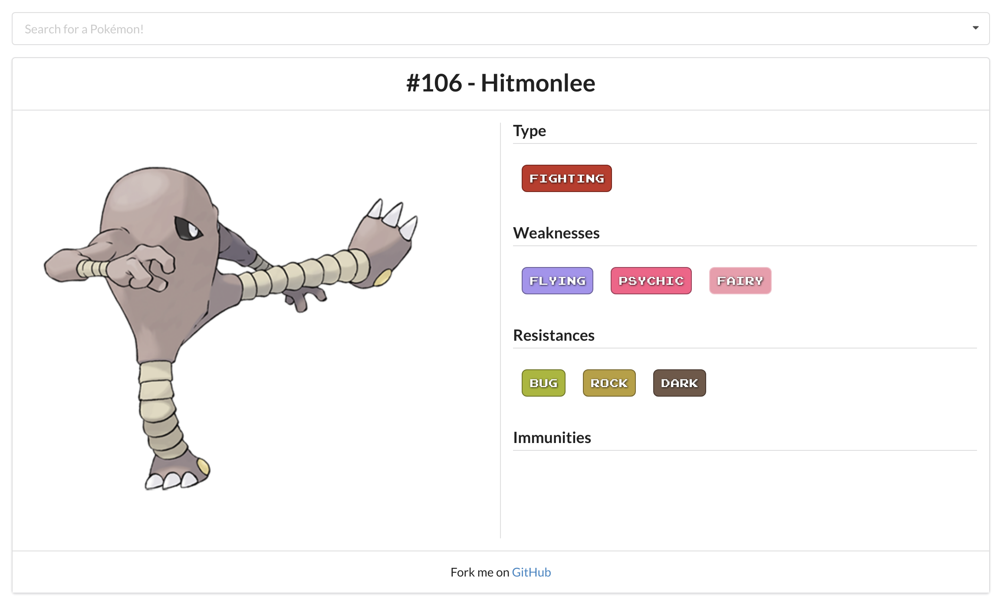

+++
title = "PokéData"
date = 2016-07-12
slug = "2016-07-12-Pokedata"
description = "Learning React + Redux with Pokémon."
+++

**Update:** I have recently rebuilt this app without Redux or PokeAPI. [Check it out over here.](https://keawade.github.io/pokedata)

Over the last month I developed a small project called [PokéData](https://keawade.github.io/pokedata-old). I built it initially to experiment and learn with [React](https://facebook.github.io/react/) and [Redux](http://redux.js.org/) but with the recent release of [Pokémon Go](http://www.pokemon.com/us/pokemon-video-games/pokemon-go/), it has become slightly more useful.

This app allows you to search nearly all of the Pokémon and view it's strengths, weaknesses, and immunities inherit to it's types. This was useful for me as I was playing through Pokemon Omega Ruby initially, but now it can also be used to plan which Pokémon you leave in gyms in Pokémon Go.

[Check it out here!](https://keawade.github.io/pokedata-old) Feel free to [report bugs or request features](https://github.com/keawade/pokedata-old/issues).
