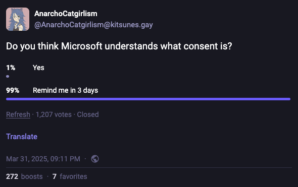

It's been a few years since I wrote my previous post, [Development Environment
Opinions][previous-post], and I've found new things, refined my tastes, etc. So
here are my _new and improved_ development environment opinions!

<!-- more -->

## Operating system

I love Linux. It does what I tell it to do and respects me as a user.

If I could wave a magic wand and update corporate IT policies I would use
[Fedora Silverblue][fedora-silverblue] for my professional work. It's stable,
performant, and atomic.

In the meantime macOS has been good enough for development. It's generally
stable and performant but they've been taking notes from Microsoft's theory of
consent over the years which is really annoying.

[][ms-consent]

<meme>Windows [is right out][monty-python-right-out].</meme> Okay, I guess I
could work with it professionally but it would be a bit of a bummer.

## Ghostty 👻

<https://ghostty.org/>

Terminal emulators just keep getting better and better. Ghostty is the latest
and greatest in my opinion. Also love that it's available cross platforms so I
don't have to maintain as much macOS vs Linux stuff in my dotfiles.

## tmux

<https://github.com/tmux/tmux>

## Neovim

<https://neovim.io/>

<meme>I use vim, btw.</meme>

Performant, customizable, open source.

Here is a short list of some of my favorite plugins:

- [telescope.nvim](https://github.com/nvim-telescope/telescope.nvim) for
  arbitrary file navigation
- [harpoon](https://github.com/ThePrimeagen/harpoon/tree/harpoon2) for fast
  targeted navigation
- [oil.nvim](github.com/stevearc/oil.nvim) for a simple but visually pleasant
  file explorer
- [Which Key](https://github.com/folke/which-key.nvim) for helping my zug brain
  learn new things I add and remember old things I don't use often
- [STCursorword](https://github.com/sontungexpt/stcursorword) for cusor word
  highlighting which is a small and very subjective thing but I like it

## fish 🐟

<https://fishshell.com/>

Fish does most of the basic things I have come to expect from a terminal right
out of the box.

I used `bash` and then `zsh` for years while accruing an ever growing list of
plugins for basic functionality that ended up slowing the start time. When I
looked into improving my setup's performance I noticed several of my primary
plugins were reimplementing functionality from `fish`. I tried `fish` and pretty
much never looked back.

I use the [`fisher` plugin manager from Jorge Bucaran][fish-fisher]. Check out
[my dotfiles for a list of plugins I use][dotfiles-fish-plugins].

## Starship 🚀

<https://starship.rs/>

Fancy shell prompt. Fast! Colorful! <meme>Written in Rust (by the way)!</meme>

## eza

<https://eza.rocks/>

Fancy `ls` replacement. Fast! Colorful! <meme>Written in Rust (by the
way)!</meme>

[previous-post]: /posts/2019-12-11-development-environment-opinions
[fedora-silverblue]: https://fedoraproject.org/atomic-desktops/silverblue/
[ms-consent]:
  https://hachyderm.io/@AnarchoCatgirlism@kitsunes.gay/114260042656271952
[monty-python-right-out]: https://youtu.be/xOrgLj9lOwk?si=f1v9Mf0xsICMsGRR&t=82
[fish-fisher]: https://github.com/jorgebucaran/fisher
[dotfiles-fish-plugins]:
  https://codeberg.org/keawade/dotfiles/src/branch/main/.config/fish/fish_plugins
